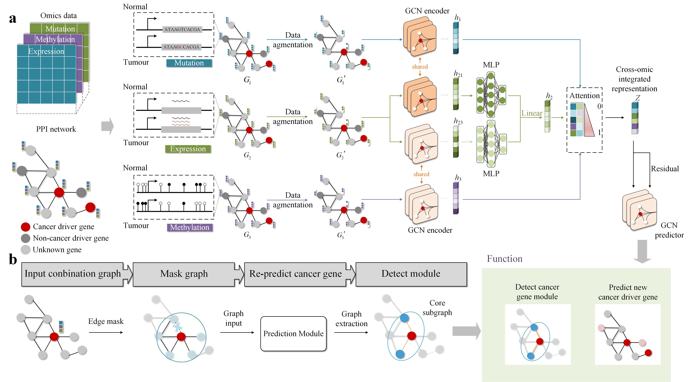

#  deepCDG
## 
## Description

## Getting Started

### Special dependencies

*   Python  3.8
*   Pytorch 1.8.0
*   Pytorch geometric 2.0.2

### Overview

The codes are organized as follows:&#x20;

*   `main.py`: the main script of deepCDG.
*   `models.py`: the implementations of models.
*   `utils.py`: the script of data input and output.

### Data

*   we provide data information for five-fold cross-validation.

### PPI files

*   The organized PPI files for CPDB can be downloaded from [CPDB_multiomics](https://github.com/xingyili/deepCDG/releases/download/v1.0.0/CPDB_multiomics.h5).

### Running deepCDG 
After you have downloaded the PPI data, You can simply run deepCDG and evaluate the performance on pan-cancer datasets by calling

`python main.py --dataset ["CPDB", "MULTINET", "STRINGdb", "PCNet", "IRefIndex", "IRefIndex_2015"]`

### Evaluate deepCDG
For other evaluation of deepCDG, please follow the instructions given here:

[https://github.com/xingyili/deepCDG-eval](https://github.com/xingyili/deepCDG-eval)

